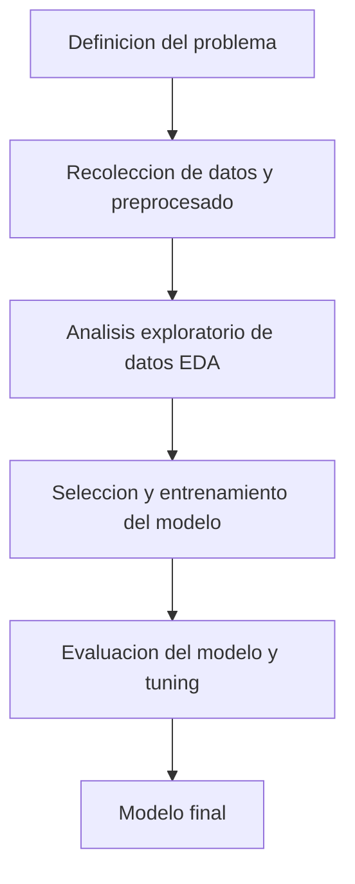

# Prediccion de Robos usando Machine Learning

## Descripcion
Este proyecto explora la prediccion de robos usando tecnicas de machine learning en el conjunto de datos de Communities and Crime unnormalized de Estados Unidos. El objetivo es analizar los factores que afectan a la cantidad de robos y comparar el rendimiento de multiples modelos de regresion.

## Objetivos del proyecto
- Realizar analisis exploratorio de datos
- Limpiar y preprocesar el dataset
- Comparar el rendimiento de los modelos usando la metrica RMSE
- Comprender la importancia de los features
- Practicar workflows de machine learning reproducibles
- Emplear metodos de finetuning

## Dataset
- **Fuente:** Communities and Crime Unnormalized de UC Irvine ml repository
- **Target:** Numero de robos en 1995
- **Features:** 125
- **Rows:** 2215
- **Nulos:** Si

## Tecnologias usadas
- Python
- Pandas
- Numpy
- Matplotlib
- Seaborn
- Scikit-Learn
- Jupyter Notebook

## Workflow/Metodologia

## 
