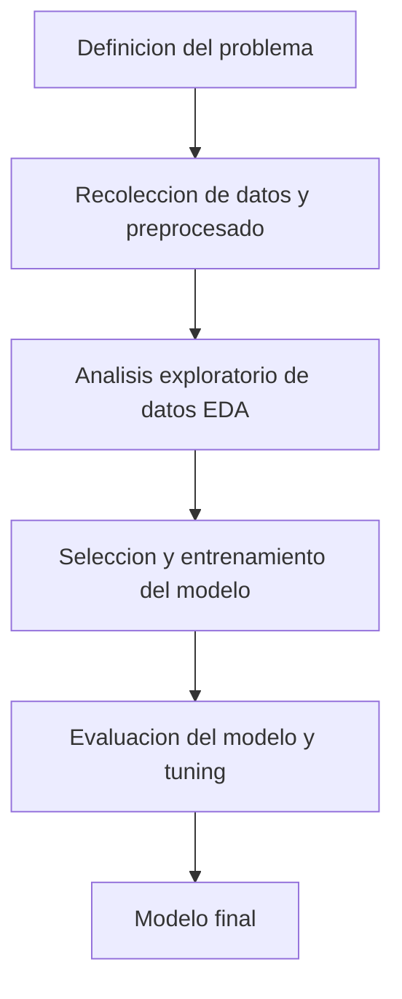

# Prediccion de Robos usando Machine Learning

## Objetivo del proyecto
A traves de un conjunto de datos que recopilan informacion de caracter socioeconomico obtenido por parte de un censo en el año de 1990, una encuesta realizada a las agencias gubernamentales de nivel loca, estatal y federal y un informe de denuncias recopilado por el Buro Federal de Investigaciones (FBI) de los Estados Unidos de America en el año 1995 se buscara predecir el numero de robos ocurridos en cada una de las comunidades de esta nacion con el objetivo de que los miembros encargados del aparato de seguridad nacional pueda gestionar con mayor eficiencia las actividades de las diversad fuerzas del orden.

## Objetivos especificos
- Realizar analisis exploratorio de datos
- Limpiar y preprocesar el dataset
- Comparar el rendimiento de los modelos usando la metrica RMSE
- Comprender la importancia de los features
- Practicar workflows de machine learning reproducibles
- Emplear metodos de finetuning
- Emplear metodos de Feature Engineering
## Dataset
- **Fuente:** Communities and Crime Unnormalized de UC Irvine ml repository
- **Target:** Numero de robos en 1995
- **Features:** 125
- **Rows:** 2215
- **Nulos:** Si

## Tecnologias usadas
- Python
- Pandas
- Numpy
- Matplotlib
- Seaborn
- Scikit-Learn
- Jupyter Notebook

## Workflow/Metodologia

## Fase actual del proyecto

- [ ] Recoleccion de datos y preprocesado
- [ ] Analisis exploratorio de datos
- [ ] Seleccion y entrenamiento del modelo
- [ ] Evaluacion del modelo y tuning
- [ ] Modelo final

## Autor

**Alejandro Santos** - Estudiante de Ingenieria en Ciencia de Datos

- [LinkedIn](https://www.linkedin.com/in/alejandro-santos-79239926b/)
- [GitHub](https://github.com/Micklevar)
- Correo: [alejandrosantosgg1930@gmail.com](mailto:alejandrosantosgg1930@gmail.com)

---

